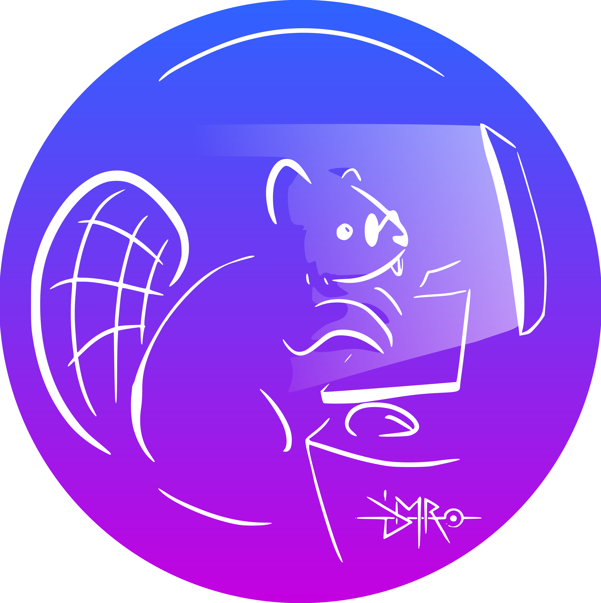

<h2 align="center">Hi there 👋, I'm ciflire</h2>

Currently studying to be an engineer.&nbsp; &nbsp; &nbsp;

At school i learned 

&nbsp;
&nbsp;
&nbsp;
&nbsp;
&nbsp;

And i learned on my own

&nbsp;
&nbsp;
&nbsp;
&nbsp;
&nbsp;
&nbsp;
&nbsp;

   

# 🚧 WIP
## OpenBar: Open source application for orders, stock management

## Blazing Tetris: 

<!--
**Ciflire/ciflire** is a ✨ _special_ ✨ repository because its `README.md` (this file) appears on your GitHub profile.

Here are some ideas to get you started:

- 🔭 I’m currently working on ...
- 🌱 I’m currently learning ...
- 👯 I’m looking to collaborate on ...
- 🤔 I’m looking for help with ...
- 💬 Ask me about ...
- 📫 How to reach me: ...
- 😄 Pronouns: ...
- ⚡ Fun fact: ...
-->
